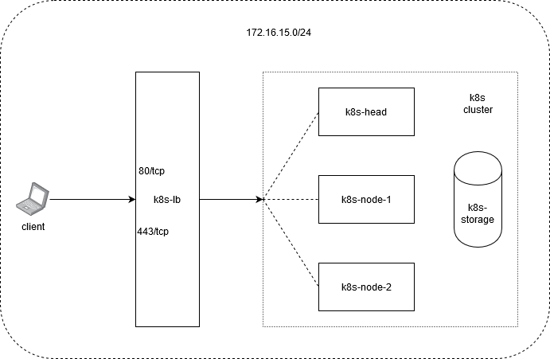

# Bootstrap new k8s cluster

This is collection of script to bootstrap new k8s cluster for using as a lab with following components are installed with minimum configuration:
- A separated `nginx` load balancer
- A k8s `nginx` ingress controller
- A `nfs` server acts as storage for k8s cluster

Tools are used:
- Vagrant
- Virtualbox
- Docker
- kubectl
- helm v3

All boxes are running CentOS 7.

`kubectl` is installed on master node `k8s-head` but you can install on your workstation, just simply copy `config` file in `~/.kube/config` on `k8s-head` to same location on your workstation.

## Network environment



All hosts are placed under same subnet: `172.16.15.0/24`
- 172.16.15.13 k8s-head
- 172.16.15.14 k8s-node-1
- 172.16.15.15 k8s-node-2
- 172.16.15.16 k8s-nfs
- 172.16.15.17 k8s-lb

## How to use

`CALICO` container network interface is chosen for this provision, which is default to `192.168.0.0/16` range for container network. If you choose other lab network CIDR than `172.16.15.0/24`, take note of this to prevent overlaping with container network.

*Before you begin*

Install Vagrant, Virtualbox, Docker on your host workstation and/or install `kubectl`, `helm v3`

*Kickstart!!!*

1. Clone this repo
    ```
    git clone git@github.com:anhcq151/centos7-k8s.git
    ```
    - Change to `centos7-k8s` folder

2. Edit file `Vagrantfile`
   - Adjust values of variables `PROXY_HTTP_PORT` and `PROXY_HTTPS_PORT` to a number of your choice in range `30000 - 32767`
   - Adjust values of variable `TIMEZONE` to change load balancer timezone to your location, I put default timezone to `Asia/Ho_Chi_Minh`

3. Start provisioning:

    Install Vagrant plugin (recommended)
    ```
    $ vagrant plugin install vagrant-vbguest vagrant-timezone
    ```
    Bring all up:
    ```
    $ vagrant up
    ```

4. Install `nginx-ingress` helm chart

    - Adapt `$PROXY_HTTP_PORT` and `$PROXY_HTTPS_PORT` variables to match ones set in step 2.
    - Adjust value of variable `NAMESPACE` to name of your choice, this is name of k8s namespace where `nginx-ingress` will be installed into.

    *Note: change "$(pwd)" in command below to the absolute path to `centos7-k8s` if you're not using Linux bash shell*

    ```
    $ docker run -dit --mount type=bind,source="$(pwd)"/data/config,target=/root/.kube/config \
        --mount type=bind,source="$(pwd)"/data/install_ingress.sh,target=/root/install_ingress.sh \
        -e NAMESPACE="loadbalancer" \
        -e PROXY_HTTP_PORT="30001" \
        -e PROXY_HTTPS_PORT="30002" \
        --name install_ingress \
        --entrypoint /root/install_ingress.sh \
        quanganh151/kubectl_helm
    ```

5. Install `nfs-client-provisioner` helm chart

    - Adjust value of variable `NAMESPACE` to name of your choice, this is name of k8s namespace where `nfs-client-provisioner` will be installed into.
    ```
    $ docker run -dit --mount type=bind,source="$(pwd)"/data/install_nfs.sh,target=/root/install_nfs.sh \
        -e NAMESPACE="nfs-storage" \
        --name isntall_nfs \
        --entrypoint /root/install_nfs.sh \
        quanganh151/kubectl_helm
    ```

## Test the new k8s cluster

I created 2 test deployments: 
- A `nginx` http web which show the default nginx welcome message.
- A pod has volume mount from a PVC, which creates new file named `SUCCESS` in that volume then exit.

All are written in `terraform` for better fire-up and destroy when done. I exported `yml` for those want to try my test using kubectl. Checkout folder `test` and deploy them:
```
$ terraform apply
```
or
```
$ kubectl create -f test_nginx-web.yml
deployment.apps/terraform-nginx created
service/nginx created
ingress.extensions/web-nginx created

$ kubectl create -f test_storage.yml
persistentvolumeclaim/test-claim created
pod/test-pod created
```

After successfully applied it, can test the ingress without modifying your `hosts` file by using `curl`.
If everything went well, can see output like below:
```
$ curl --verbose --header 'Host: nginx-web.local' 172.16.15.17
* Rebuilt URL to: 172.16.15.17/
*   Trying 172.16.15.17...
* TCP_NODELAY set
* Connected to 172.16.15.17 (172.16.15.17) port 80 (#0)
> GET / HTTP/1.1
> Host: nginx-web.local
> User-Agent: curl/7.58.0
> Accept: */*
>
< HTTP/1.1 200 OK
< Server: nginx/1.17.9
< Date: Tue, 17 Mar 2020 15:49:09 GMT
< Content-Type: text/html
< Content-Length: 612
< Connection: keep-alive
< Last-Modified: Tue, 02 Dec 2014 13:35:07 GMT
< ETag: "547dc00b-264"
< Accept-Ranges: bytes
<
<!DOCTYPE html>
<html>
<head>
<title>Welcome to nginx!</title>
<style>
    body {
        width: 35em;
        margin: 0 auto;
        font-family: Tahoma, Verdana, Arial, sans-serif;
    }
</style>
</head>
<body>
<h1>Welcome to nginx!</h1>
<p>If you see this page, the nginx web server is successfully installed and
working. Further configuration is required.</p>

<p>For online documentation and support please refer to
<a href="http://nginx.org/">nginx.org</a>.<br/>
Commercial support is available at
<a href="http://nginx.com/">nginx.com</a>.</p>

<p><em>Thank you for using nginx.</em></p>
</body>
</html>
* Connection #0 to host 172.16.15.17 left intact
```
Login to `k8s-nfs` box and check nfs shared folder:
```
[vagrant@k8s-nfs ~]$ ls /var/nfsshare/ -l
total 0
drwxrwxrwx. 2 root root 21 Mar 17 21:59 default-test-claim-pvc-d26d7c4c-0900-4be6-aa32-a1142c561d6c
[vagrant@k8s-nfs ~]$ ls /var/nfsshare/default-test-claim-pvc-d26d7c4c-0900-4be6-aa32-a1142c561d6c/
SUCCESS
```
All went well, cleanup our test:
```
$ terraform destroy
```
or
```
$ kubectl delete -f test_nginx-web.yml
deployment.apps "terraform-nginx" deleted
service "nginx" deleted
ingress.extensions "web-nginx" deleted

$ kubectl delete -f test_storage.yml
persistentvolumeclaim "test-claim" deleted
pod "test-pod" deleted
```

**Enjoy the cluster!!!**

>Tested on my workstation: 
>- OS: Windows 10 build 1909 x64
>- vagrant version 2.2.7
>- virtualbox version 6.1.4
>- Shell environment: Ubuntu 18.04 in WSL
>- Docker version 19.03.8